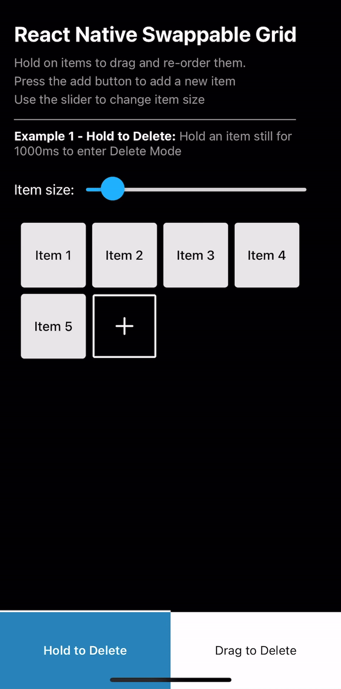
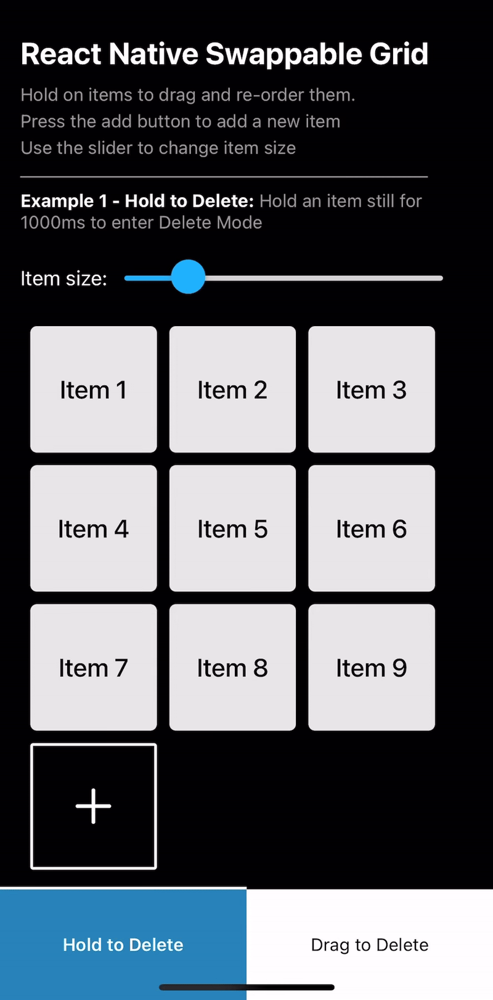
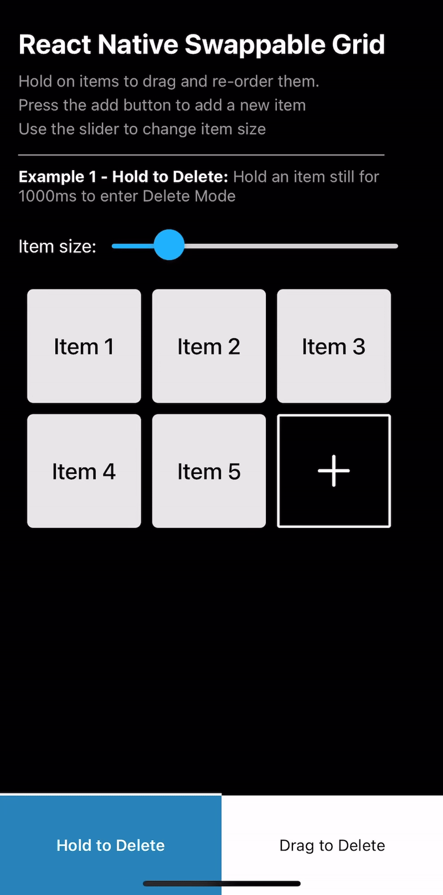
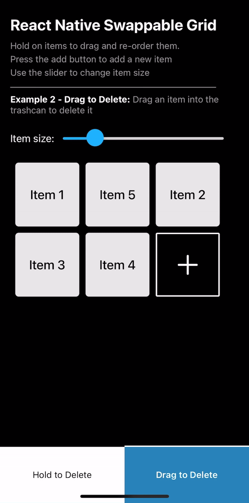

# react-native-swappable-grid

A powerful React Native component for creating draggable, swappable grid layouts with smooth animations, reordering, and delete functionality.

## Features

- 🎯 **Drag & Drop**: Long press to drag and reorder items in a grid layout
- 📐 **Flexible Layout**: Automatic column calculation or fixed number of columns
- 🎨 **Smooth Animations**: Optional wiggle animation during drag mode
- 🗑️ **Delete Support**: Built-in hold-still-to-delete or custom delete component (trashcan)
- ➕ **Trailing Components**: Support for additional components (e.g., "Add" button)
- 📜 **Auto-scroll**: Automatic scrolling when dragging near edges
- 🔄 **Order Tracking**: Callbacks for order changes and drag end events
- ⚡ **Performance**: Built with React Native Reanimated and Gesture Handler for 60fps animations

## 📱 Demo

<h3 align="center">
  Drag and re-order items
</h3>

<div align="center">
  
</div>

</br>
</br>

<h3 align="center">
  Add new items
</h3>

<div align="center">
  
</div>

</br>
</br>

<h3 align="center">
  The grid can have handle any item size and adjustes itself dynamically
</h3>

<div align="center">
  
</div>

</br>
</br>

<h3 align="center">
  Hold still to delete items
</h3>

<div align="center">
  
</div>

</br>
</br>

<h3 align="center">
  Drag to delete items
</h3>

<div align="center">
  
</div>

</br>
</br>

## Example Project

To see common usages and examples. Check out the example project 🚀

- [react-native-swappable-grid-example-app-repo](https://github.com/WilliamDanielsson/react-native-swappable-grid-example)

## Installation

```bash
npm install react-native-swappable-grid
# or
yarn add react-native-swappable-grid
```

### Peer Dependencies

This package requires the following peer dependencies:

```bash
npm install react react-native react-native-gesture-handler react-native-reanimated
# or
yarn add react react-native react-native-gesture-handler react-native-reanimated
```

**Important**: Make sure to follow the setup instructions for:

- [react-native-gesture-handler](https://docs.swmansion.com/react-native-gesture-handler/docs/fundamentals/installation/)
- [react-native-reanimated](https://docs.swmansion.com/react-native-reanimated/docs/fundamentals/getting-started/)

**TLDR**: Wrap your app with the GestureHandlerRootView inside RootLayout in \_layout.tsx

Additional fix for now: Disable Strict Mode for Reanimated because of logger warnings did I did not manage to get rid of.

```tsx
import { Slot } from "expo-router";
import { GestureHandlerRootView } from "react-native-gesture-handler";
import {
  configureReanimatedLogger,
  ReanimatedLogLevel,
} from "react-native-reanimated";

// Strict mode is disabled because it gave warnings in SwappableGrid with useSharedValue()
configureReanimatedLogger({
  level: ReanimatedLogLevel.warn, // Only log warnings & errors
  strict: false, // Disable strict mode warnings
});

export default function RootLayout() {
  return (
    <GestureHandlerRootView>
      <Slot />
    </GestureHandlerRootView>
  );
}
```

## Basic Usage

```tsx
import React, { useState } from "react";
import { View, Text } from "react-native";
import { SwappableGrid } from "react-native-swappable-grid";

const MyComponent = () => {
  const [items, setItems] = useState([
    { id: "1", title: "Item 1" },
    { id: "2", title: "Item 2" },
    { id: "3", title: "Item 3" },
  ]);

  return (
    <SwappableGrid
      itemWidth={100}
      itemHeight={100}
      numColumns={3} /* leave excluded for dynamic columns */
      gap={8}
      onOrderChange={(keys) => {
        // Reorder items based on new key order
        const newOrder = keys
          .map((key) => items.find((item) => item.id === key))
          .filter(Boolean);
        setItems(newOrder);
      }}
    >
      {items.map((item) => (
        <View
          key={item.id}
          style={{ backgroundColor: "#ccc", borderRadius: 8 }}
        >
          <Text>{item.title}</Text>
        </View>
      ))}
    </SwappableGrid>
  );
};
```

## API Reference

### SwappableGrid Props

| Prop                     | Type                                    | Usage    | Default | Description                                                                                                                                       |
| ------------------------ | --------------------------------------- | -------- | ------- | ------------------------------------------------------------------------------------------------------------------------------------------------- |
| `children`               | `ReactNode`                             | Required | -       | The child components to render in the grid. Each child should have a unique key.                                                                  |
| `itemWidth`              | `number`                                | Required | -       | Width of each grid item in pixels                                                                                                                 |
| `itemHeight`             | `number`                                | Required | -       | Height of each grid item in pixels                                                                                                                |
| `gap`                    | `number`                                | Optional | `8`     | Gap between grid items in pixels                                                                                                                  |
| `containerPadding`       | `number`                                | Optional | `8`     | Padding around the container in pixels                                                                                                            |
| `holdToDragMs`           | `number`                                | Optional | `300`   | Duration in milliseconds to hold before drag starts                                                                                               |
| `numColumns`             | `number`                                | Optional | Auto    | Number of columns in the grid. If not provided, will be calculated automatically based on container width                                         |
| `wiggle`                 | `{ duration: number; degrees: number }` | Optional | -       | Wiggle animation configuration when items are in drag mode                                                                                        |
| `wiggleDeleteMode`       | `{ duration: number; degrees: number }` | Optional | -       | Wiggle animation configuration specifically for delete mode. If not provided, uses 2x degrees and 0.7x duration of `wiggle` prop                  |
| `holdStillToDeleteMs`    | `number`                                | Optional | `1000`  | Duration in milliseconds to hold an item still before entering delete mode                                                                        |
| `onDragEnd`              | `(ordered: ChildNode[]) => void`        | Optional | -       | Callback fired when drag ends, providing the ordered array of child nodes                                                                         |
| `onOrderChange`          | `(keys: string[]) => void`              | Optional | -       | Callback fired when the order changes, providing an array of keys in the new order                                                                |
| `onDelete`               | `(key: string) => void`                 | Optional | -       | Callback fired when an item is deleted, providing the key of the deleted item                                                                     |
| `dragSizeIncreaseFactor` | `number`                                | Optional | `1.06`  | Factor by which the dragged item scales up                                                                                                        |
| `scrollSpeed`            | `number`                                | Optional | `10`    | Speed of auto-scrolling when dragging near edges                                                                                                  |
| `scrollThreshold`        | `number`                                | Optional | `100`   | Distance from edge in pixels that triggers auto-scroll                                                                                            |
| `style`                  | `StyleProp<ViewStyle>`                  | Optional | -       | Custom style for the ScrollView container                                                                                                         |
| `trailingComponent`      | `ReactNode`                             | Optional | -       | Component to render after all grid items (e.g., an "Add" button)                                                                                  |
| `deleteComponent`        | `ReactNode`                             | Optional | -       | Component to render as a delete target (shown when dragging), kind of like a trashcan feature. If provided, disables hold-still-to-delete feature |
| `deleteComponentStyle`   | `StyleProp<ViewStyle>`                  | Optional | -       | Custom style for the delete component. If provided, allows custom positioning                                                                     |
| `reverse`                | `boolean`                               | Optional | `false` | If true, reverses the order of items (right-to-left, bottom-to-top)                                                                               |

### SwappableGridRef

The component can be used with a ref to access imperative methods:

Very useful interactive feature for canceling deleteMode when clicking outside the grid. See [example project](<https://github.com/WilliamDanielsson/react-native-swappable-grid-example/blob/main/app/(tabs)/holdToDelete/index.tsx>) for example usage.

```tsx
import { StyleSheet, Pressable} from "react-native";
import { SwappableGrid, SwappableGridRef } from "react-native-swappable-grid";

const gridRef = useRef<SwappableGridRef>(null);

return (
   <Pressable
      style={StyleSheet.absoluteFill}
      onPress={() => {
        // Cancel delete mode when user taps outside the grid
        if (gridRef.current) {
          gridRef.current.cancelDeleteMode();
        }
      }}
    >
      <SwappableGrid ref={gridRef} ... />
    </Pressable>
)
```

| Method               | Description                                                     |
| -------------------- | --------------------------------------------------------------- |
| `cancelDeleteMode()` | Cancels the delete mode if any item is currently in delete mode |

## Examples

### With Wiggle Animation

```tsx
<SwappableGrid
  itemWidth={100}
  itemHeight={100}
  numColumns={3} /* leave excluded for dynamic columns */
  wiggle={{ duration: 200, degrees: 3 }}
  onOrderChange={(keys) => console.log("New order:", keys)}
>
  {items.map((item) => (
    <View key={item.id}>{item.content}</View>
  ))}
</SwappableGrid>
```

### Auto-calculated Columns

```tsx
<SwappableGrid
  itemWidth={100}
  itemHeight={100}
  gap={12}
  containerPadding={16}
  // numColumns not provided - will be calculated automatically
  onOrderChange={(keys) => console.log("New order:", keys)}
>
  {items.map((item) => (
    <View key={item.id}>{item.content}</View>
  ))}
</SwappableGrid>
```

### With Trailing Component (Add Button)

```tsx
<SwappableGrid
  itemWidth={100}
  itemHeight={100}
  numColumns={3}
  trailingComponent={
    /* trailingComponent gets positioned at the end of the grid */
    <Pressable
      onPress={() => addNewItem()}
      style={{
        backgroundColor: "#007AFF",
        borderRadius: 8,
        justifyContent: "center",
        alignItems: "center",
      }}
    >
      <Text style={{ color: "white", fontSize: 24 }}>+</Text>
    </Pressable>
  }
>
  {items.map((item) => (
    <View key={item.id}>{item.content}</View>
  ))}
</SwappableGrid>
```

### With Delete Functionality (Hold-still-to-Delete)

**Note**: Hold-still-to-delete is only enabled when `onDelete` is provided. If you don't want deletion functionality, simply omit the `onDelete` prop.

```tsx
<SwappableGrid
  itemWidth={100}
  itemHeight={100}
  numColumns={3}
  holdStillToDeleteMs={1500} // Hold for 1.5 seconds to enter delete mode
  onDelete={(key) => {
    setItems(items.filter((item) => item.id !== key));
  }}
>
  {items.map((item) => (
    <View key={item.id}>{item.content}</View>
  ))}
</SwappableGrid>
```

### With Delete Component (custom component where you can drag items into to delete. Kind of like a trashcan)

**Note**: By default HoldToDelete is enabled if you have a onDelete prop. If you use DeleteComponent then only DeleteComponent is used as the way to delete. In other words. You can choose to either delete items by holding or by using DeleteComponent.

```tsx
<SwappableGrid
  itemWidth={100}
  itemHeight={100}
  numColumns={3}
  deleteComponent={
    <View
      style={{
        backgroundColor: "red",
        borderRadius: 8,
        justifyContent: "center",
        alignItems: "center",
      }}
    >
      <Text style={{ color: "white" }}>Drop to Delete</Text>
    </View>
  }
  deleteComponentStyle={{
    /* By default DeleteComponent acts like the TrailingComponent. Positioning itself at the end of the grid. By using deleteComponentStyle you can change it to have a static position if you want it to be at a specific place */
    position: "absolute",
    top: 20,
    right: 20,
    width: 100,
    height: 100,
  }}
  onDelete={(key) => {
    setItems(items.filter((item) => item.id !== key));
  }}
>
  {items.map((item) => (
    <View key={item.id}>{item.content}</View>
  ))}
</SwappableGrid>
```

## How It Works

1. **Long Press**: Hold an item for `holdToDragMs` milliseconds to enter drag mode
2. **Drag**: Move the item to swap positions with other items
3. **Auto-scroll**: When dragging near edges, the grid automatically scrolls
4. **Delete**:
   - **Hold-Still-to-delete**: Hold an item still for `holdStillToDeleteMs` (default: 1000ms) to enter delete mode (shows delete button). Only enabled when `onDelete` is provided.
   - **Delete component**: Drag an item to the delete component to delete it
5. **Order Change**: The `onOrderChange` callback fires whenever items are reordered

## Notes

- Each child component **must** have a unique `key` prop
- The component uses `react-native-reanimated` for smooth 60fps animations
- Deletion is only enabled when `onDelete` is provided. By default hold-still-to-delete is selected delete method. If `deleteComponent` is provided, hold-still-to-delete is automatically disabled and `deleteComponent` is used as the way to delete.
- The trailing component is positioned after all grid items
- The delete component appears only when dragging (if provided)
- If `wiggleDeleteMode` is not provided, delete mode wiggle uses 2x degrees and 0.7x duration of the `wiggle` prop

## License

ISC

## Contributing

Contributions are welcome! Please feel free to submit a Pull Request.
